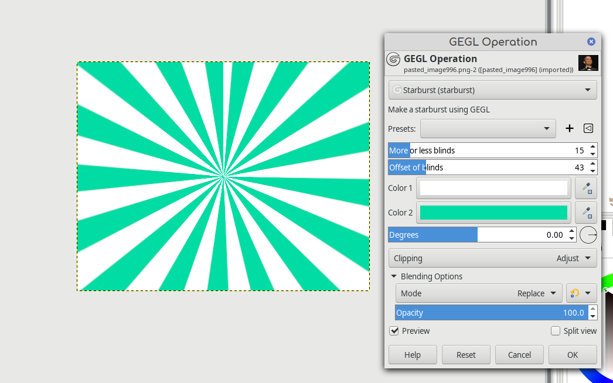

# gegl-starburst
GEGL Starburst. A new GEGL filter that makes a quality movable starburst. On Linux you have the option to build or put the .so files in /gegl-0.4/plug-ins . Have fun with the new GEGL filter. 

