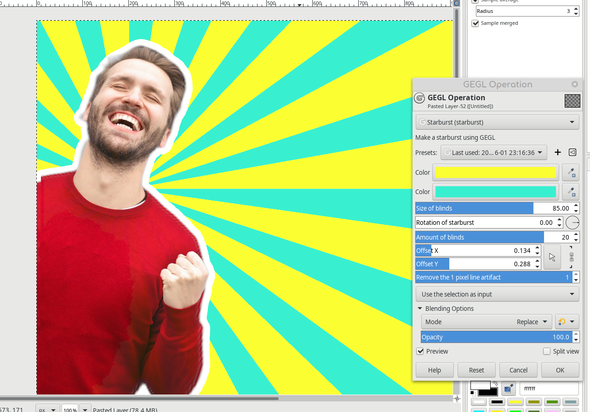

# gegl-starburst
GEGL Starburst. A new GEGL filter that makes a quality movable starburst. On Linux you have the option to build or put the .so files in /gegl-0.4/plug-ins . Have fun with the new GEGL filter. 

## OS specific location to put GEGL Filter binaries 

Windows
 C:\\Users\<YOUR NAME>\AppData\Local\gegl-0.4\plug-ins
 
 Linux 
 /home/(USERNAME)/.local/share/gegl-0.4/plug-ins
 
 Linux (Flatpak)
 /home/(USERNAME)/.var/app/org.gimp.GIMP/data/gegl-0.4/plug-ins
